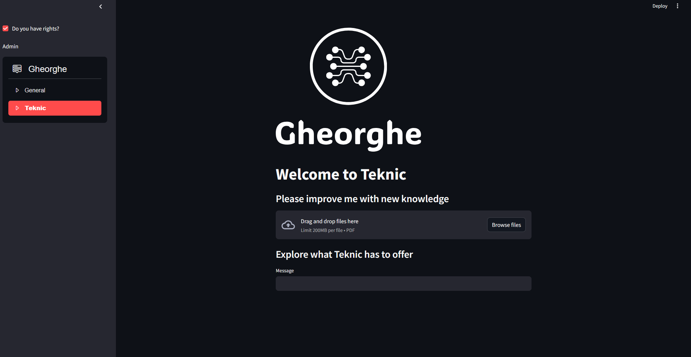
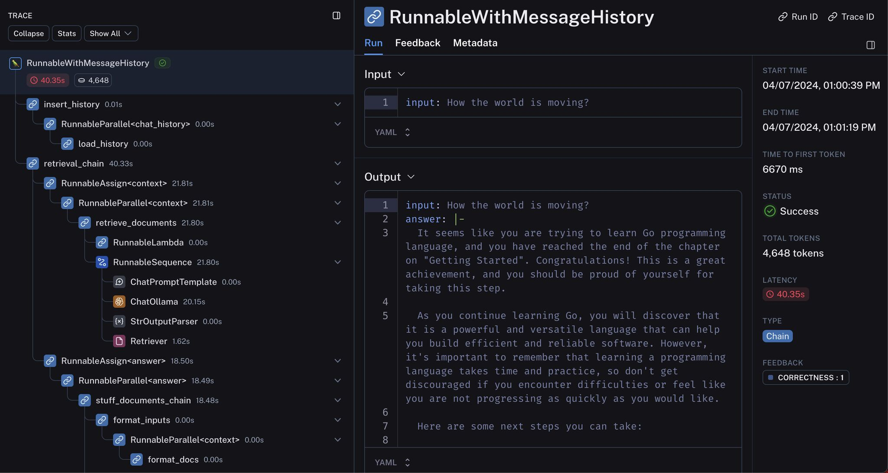
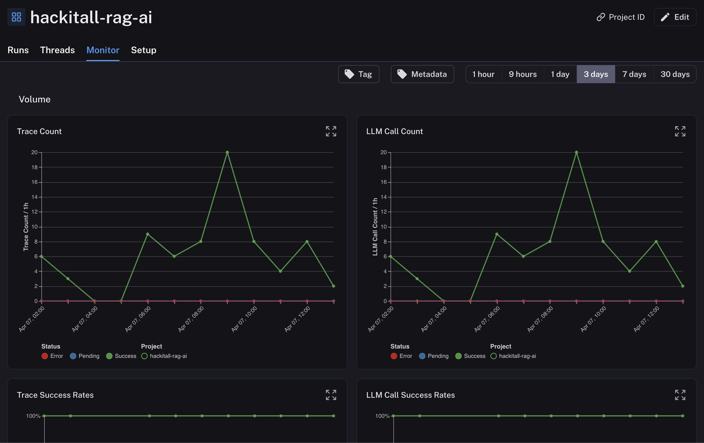

# RAG Chatbot
Our solution proposes a local run model using Ollama, using the Llama2 model and embeddings. The model is trained on the English Wikipedia and the BookCorpus dataset. The model is fine-tuned on the RAG dataset. The model is then used to generate responses to user queries. The model is deployed using Streamlit.


Monitoring at: [This Link](https://smith.langchain.com/o/a22a047e-875d-50aa-85c2-d8d11933585d/projects/p/8822f4e1-0806-44cc-ad34-68ae0cd92ce2?timeModel=%7B%22duration%22%3A%227d%22%7D)

We chose the Llama2 model because it is open source and we can make it run locally even on a low cost laptop with the framework Ollama. Alongside with this we have used the following libraries:

- Streamlit
- LangChain
- ChromaDB

And the following methods:

- Chain-of-thought
- Filtering
- Re-ranking of answers

The user interface can be seen below:



Which have multiple functionalities like:
- Adding a new document
- Asking a question
- Changing the user to admin


## Logs and Metrics

The application logs each response with the availability to view the logs in the LangChain dashboard.



We can see the response the date and the retreval process from the vector database and chain-of-thought method used.



The count call and the response accuracy is also available in the dashboard. More than that even the price payed for the call is available.

Monitoring at: [This Link](https://smith.langchain.com/o/a22a047e-875d-50aa-85c2-d8d11933585d/projects/p/8822f4e1-0806-44cc-ad34-68ae0cd92ce2?timeModel=%7B%22duration%22%3A%227d%22%7D)

## How to start
Move to the ```src``` directory and run the following command:
```
streamlit run app.py
```
